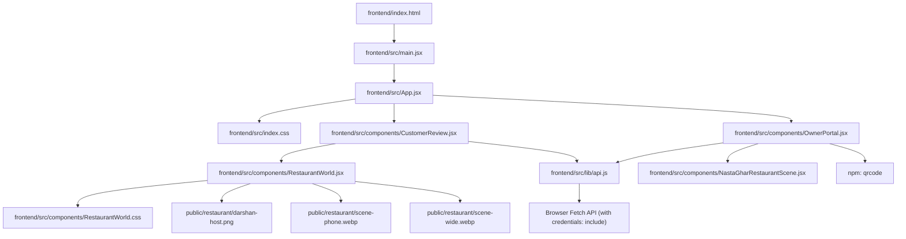
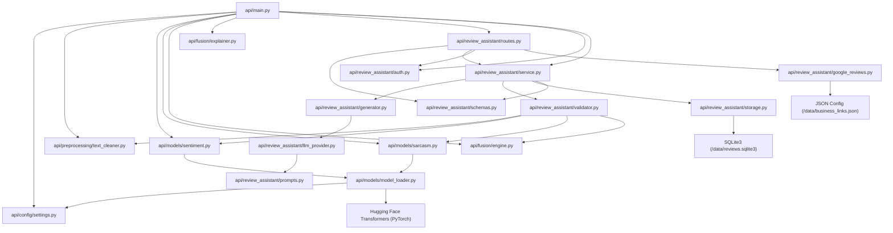
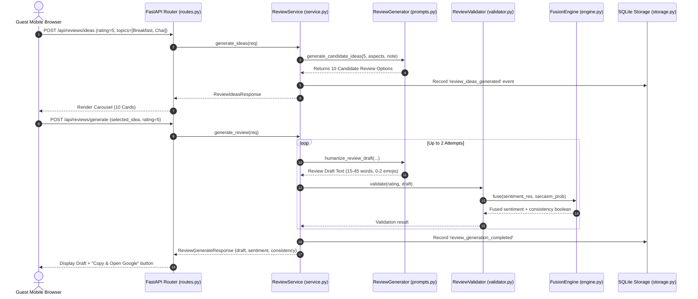

# FILE_DEPENDENCY_GRAPH.md — Module Relationships & Dependency Tracing

**Generated Date:** September 29, 2026  
**Project:** ChurnLens / Nasta Ghar AI Review Assistant (`v2.4.0`)  

---

## 1. System Architecture & Entry Points

The system consists of two primary runtime execution layers:
1. **Frontend Entry:** [`frontend/src/main.jsx`](file:///d:/churnlens/frontend/src/main.jsx) $\rightarrow$ [`frontend/src/App.jsx`](file:///d:/churnlens/frontend/src/App.jsx) (Serves `/review` customer experience and `/owner` dashboard).
2. **Backend Entry:** [`api/main.py`](file:///d:/churnlens/api/main.py) (FastAPI REST service with registered `/api` router).

---

## 2. Frontend Dependency Graph

---

## 3. Backend Module Dependency Graph

---

## 4. Review Generation and Validation Flow

---

## 5. File-by-File Dependency & Runtime Matrix

| File Path | Imported By | Imports / Dependencies | Runtime Role | Evidence / References | Confidence |
| :--- | :--- | :--- | :--- | :--- | :---: |
| [`api/main.py`](file:///d:/churnlens/api/main.py) | Uvicorn server entry | `fastapi`, `dotenv`, `pydantic`, `api.config.settings`, `api.models.*`, `api.fusion.*`, `api.review_assistant.*` | **Core API Server** | Defined in `start_app.bat` line 28 & Dockerfile | High |
| [`api/config/settings.py`](file:///d:/churnlens/api/config/settings.py) | `api/main.py`, `api/models/model_loader.py` | `pydantic` | **Configuration** | Model names (`cardiffnlp/...`), thresholds, device config | High |
| [`api/preprocessing/text_cleaner.py`](file:///d:/churnlens/api/preprocessing/text_cleaner.py) | `api/main.py`, `api/review_assistant/validator.py` | `re`, `emoji`, `contractions` | **Text Cleaning** | Cleans reviews before NLP inference | High |
| [`api/models/model_loader.py`](file:///d:/churnlens/api/models/model_loader.py) | `api/models/sentiment.py`, `api/models/sarcasm.py` | `torch`, `transformers`, `api.config.settings` | **Model Loader** | Thread-safe singleton lazy loader for RoBERTa pipelines | High |
| [`api/models/sentiment.py`](file:///d:/churnlens/api/models/sentiment.py) | `api/main.py`, `api/review_assistant/validator.py` | `api.models.model_loader`, `time` | **Sentiment Model** | Extracts positive/neutral/negative probabilities | High |
| [`api/models/sarcasm.py`](file:///d:/churnlens/api/models/sarcasm.py) | `api/main.py`, `api/review_assistant/validator.py` | `api.models.model_loader`, `time` | **Sarcasm Model** | Extracts irony probability score | High |
| [`api/fusion/engine.py`](file:///d:/churnlens/api/fusion/engine.py) | `api/main.py`, `api/review_assistant/validator.py` | `api.config.settings` | **Fusion Engine** | Re-weights sentiment based on sarcasm activation threshold | High |
| [`api/fusion/explainer.py`](file:///d:/churnlens/api/fusion/explainer.py) | `api/main.py` | None | **Integrity Explainer** | Explains sentiment fusion reasoning | High |
| [`api/review_assistant/routes.py`](file:///d:/churnlens/api/review_assistant/routes.py) | `api/main.py` | `fastapi`, `api.review_assistant.*` | **HTTP Router** | Exposes 11 endpoints under `/api` prefix | High |
| [`api/review_assistant/schemas.py`](file:///d:/churnlens/api/review_assistant/schemas.py) | `api/review_assistant/routes.py`, `api/review_assistant/service.py` | `pydantic` | **Data Schemas** | Pydantic validation for all requests and responses | High |
| [`api/review_assistant/service.py`](file:///d:/churnlens/api/review_assistant/service.py) | `api/main.py`, `api/review_assistant/routes.py` | `api.review_assistant.*`, `uuid`, `time`, `collections` | **Business Logic** | Orchestrates review drafting, validation, rate limits, analytics | High |
| [`api/review_assistant/auth.py`](file:///d:/churnlens/api/review_assistant/auth.py) | `api/main.py`, `api/review_assistant/routes.py` | `hmac`, `hashlib`, `fastapi`, `secrets` | **Owner Auth** | Signed session cookie auth, brute-force rate limiter, CSRF check | High |
| [`api/review_assistant/storage.py`](file:///d:/churnlens/api/review_assistant/storage.py) | `api/review_assistant/service.py` | `sqlite3`, `json`, `os`, `pathlib` | **Persistence** | SQLite WAL-mode repository for events and tickets | High |
| [`api/review_assistant/google_reviews.py`](file:///d:/churnlens/api/review_assistant/google_reviews.py) | `api/review_assistant/routes.py` | `json`, `pathlib`, `os` | **Config Manager** | Atomic JSON persistence for business links & topics | High |
| [`api/review_assistant/generator.py`](file:///d:/churnlens/api/review_assistant/generator.py) | `api/review_assistant/service.py` | `api.review_assistant.llm_provider` | **Generation Dispatcher**| Dispatches to Local or Cloud provider | High |
| [`api/review_assistant/llm_provider.py`](file:///d:/churnlens/api/review_assistant/llm_provider.py) | `api/review_assistant/generator.py` | `api.review_assistant.prompts`, `urllib` | **LLM Abstraction** | LocalLLMProvider and optional CloudLLMProvider | High |
| [`api/review_assistant/prompts.py`](file:///d:/churnlens/api/review_assistant/prompts.py) | `api/review_assistant/llm_provider.py` | `random`, `typing` | **Prompts & Synthesis**| Deterministic 10 ideas generator & zero-fabrication rules | High |
| [`frontend/src/main.jsx`](file:///d:/churnlens/frontend/src/main.jsx) | `frontend/index.html` | `react`, `react-dom`, `App.jsx` | **React Root** | Mounts React component tree into DOM `#root` | High |
| [`frontend/src/App.jsx`](file:///d:/churnlens/frontend/src/App.jsx) | `frontend/src/main.jsx` | `CustomerReview`, `OwnerPortal`, `index.css` | **View Controller** | Selects customer or owner view based on URL | High |
| [`frontend/src/lib/api.js`](file:///d:/churnlens/frontend/src/lib/api.js) | `CustomerReview.jsx`, `OwnerPortal.jsx` | `fetch` API | **API Client** | Configures `VITE_API_BASE_URL` & cookie credentials | High |
| [`frontend/src/components/CustomerReview.jsx`](file:///d:/churnlens/frontend/src/components/CustomerReview.jsx) | `frontend/src/App.jsx` | `RestaurantWorld`, `api.js` | **Guest Experience** | Complete 1-5 star review journey, ideas carousel, copy & Maps | High |
| [`frontend/src/components/OwnerPortal.jsx`](file:///d:/churnlens/frontend/src/components/OwnerPortal.jsx) | `frontend/src/App.jsx` | `qrcode`, `NastaGharRestaurantScene`, `api.js` | **Owner Dashboard** | Password sign-in, analytics graphs, tickets, QR customizer | High |
| [`frontend/src/components/RestaurantWorld.jsx`](file:///d:/churnlens/frontend/src/components/RestaurantWorld.jsx) | `CustomerReview.jsx` | `RestaurantWorld.css` | **Scene Animation** | Interactive Darshanbhai greeting & atmospheric audio/visuals | High |
| [`frontend/src/components/NastaGharRestaurantScene.jsx`](file:///d:/churnlens/frontend/src/components/NastaGharRestaurantScene.jsx) | `OwnerPortal.jsx` | React | **Scene Preview** | Interactive visual preview of dining environment | High |
