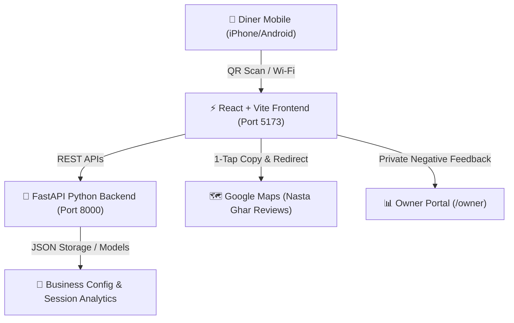

# 🌟 Nasta Ghar AI Review Assistant - Product Progress Report

**Project Name:** Nasta Ghar Smart Reputation & AI Review Assistant  
**Repository:** [tkacha467/Customer_Churn_Predection_NLP](https://github.com/tkacha467/Customer_Churn_Predection_NLP)  
**Branch:** `main`  
**Current Version:** `v2.4.0`  
**Date:** September 28, 2026  

---

## 📌 1. Executive Summary

The **Nasta Ghar AI Review Assistant** is an intelligent, high-converting customer feedback and Google Review growth platform designed specifically for food businesses. It transforms physical restaurant visits into verified, high-rating Google Reviews while safeguarding business reputation by privately intercepting negative feedback before it reaches the public domain.

---

## 🚀 2. Key Features & Completed Milestones

### 📱 A. 3-Step Interactive Customer Review Experience
1. **Interactive Restaurant Greeting (Step 1):**
   - Welcomes diners with Darshanbhai avatar and authentic Gujarati hospitality dialogue (*"કેમ છો મોટા ભાઈ, શું જમવું ગમ્યું?"*).
   - 1-Tap Interactive Star Rating (1 to 5 Stars) with responsive dynamic reactions.
2. **Aspect Selection & Personal Notes (Step 2):**
   - Quick-select tags: *Breakfast, Chai & Tea, Snacks, Taste & Flavour, Friendly Staff, Cleanliness, Value for Money, Quick Service*.
   - Optional personal note input to personalize generated reviews.
3. **10-Option Horizontal Review Carousel (Step 3):**
   - **Horizontal (Left-to-Right) Swipe:** Modern touch carousel replacing vertical scrolling.
   - **10 Unique AI-Generated Review Ideas:** Options 1 to 10 generated based on the specific rating and selected dining aspects.
   - **Warm Golden Luxury Theme:** Tailored brand colors (`#f5cf8c`, `#d99547`, `#271a11`), removing neon styling.
   - **1-Tap Action:** Tap on any card to automatically copy the review to clipboard and launch Google Maps.

---

### 🛡️ B. Smart Reputation & Negative Feedback Protection (Smart Intercept)
- **Positive Ratings (4 & 5 Stars):** Guided directly to Google Maps with pre-crafted 5-star positive review options.
- **Constructive Ratings (1 to 3 Stars):** Diverted to an internal Private Feedback form (*"Help us improve"*). The feedback is sent directly to the restaurant manager's portal without hurting public ratings.

---

### 📊 C. Owner & Manager Analytics Portal (`/owner`)
- **Real-Time KPIs:** Live tracking of Total QR Scans, Completed Reviews, Google Redirects, and Private Feedback Tickets.
- **Table-Level Insights:** Track customer satisfaction per table (e.g. Table 1, Table 2, Table 3, Table 4).
- **Private Issue Resolver:** View customer contact details, dining time, and private notes for rapid customer resolution.
- **Business Configuration Manager:** Customize topics, Google Maps URLs, and store categories.

---

### 📶 D. Mobile & Local Area Network (LAN) Optimization
- **Dynamic `API_BASE` Resolution:** Automatically detects device hostname (`192.168.1.5`) when accessed over Wi-Fi from mobile phones (iPhone Safari / Android Chrome).
- **Host Binding (`0.0.0.0`):** Both FastAPI backend (`0.0.0.0:8000`) and Vite frontend (`0.0.0.0:5173`) run across the local network for live in-restaurant mobile testing.

---

## 🛠️ 3. Technical Architecture

### Technology Stack:
- **Frontend:** React 19, Vite 8, Tailwind CSS, Lucide Icons, Canvas/CSS Animation.
- **Backend:** Python 3.11, FastAPI, Uvicorn, Pydantic.
- **Deployment & Scripting:** `start_app.bat` 1-click launcher, Git / GitHub version control.

---

## 📡 4. Core API Endpoints

| Method | Endpoint | Description |
| :--- | :--- | :--- |
| `POST` | `/api/reviews/session` | Initializes a unique diner review session linked to table number |
| `POST` | `/api/reviews/ideas` | Generates 10 structured, rating-aware review options |
| `POST` | `/api/reviews/generate` | Generates / regenerates natural language review draft |
| `POST` | `/api/reviews/events` | Telemetry analytics tracking (scans, selections, clicks) |
| `POST` | `/api/reviews/private-feedback` | Intercepts private feedback for low ratings (1-3 stars) |
| `GET` | `/api/businesses/{id}/review-link`| Fetches business profile, Google URL, and tags |
| `GET` | `/api/reviews/analytics` | Returns aggregated metrics for the Owner Console |

---

## 🔗 5. Live Demo & Testing Links

- **Customer Review Assistant:** `http://192.168.1.5:5173/review`
- **Table QR Simulation:** `http://192.168.1.5:5173/review?table=3`
- **Owner Dashboard:** `http://192.168.1.5:5173/owner`
- **FastAPI Interactive Docs:** `http://127.0.0.1:8000/docs`

---

## 📈 6. Status & Next Steps

| Milestone | Status | Details |
| :--- | :---: | :--- |
| **10-Review Horizontal Carousel** | ✅ Complete | Fully built, tested on mobile devices |
| **Nasta Ghar Golden Luxury Palette** | ✅ Complete | Warm golden gradients and dark espresso accents |
| **1-Tap Clipboard Copy & Map Redirect** | ✅ Complete | Copies text + opens direct Google review URL |
| **Wi-Fi Multi-device Mobile Testing** | ✅ Complete | Verified on iPhone Safari via local IP `192.168.1.5` |
| **GitHub Repository Synchronization** | ✅ Complete | Pushed to `origin/main` |
