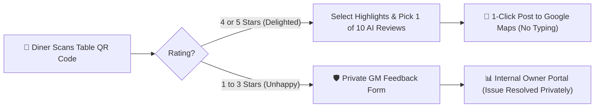
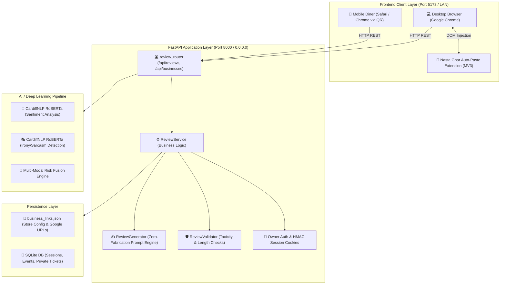
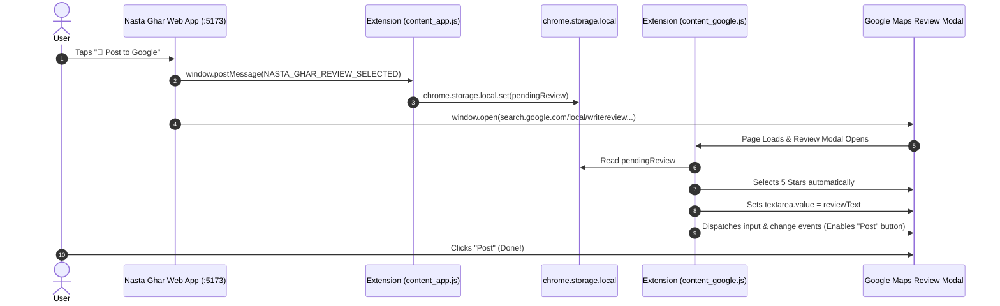

# 🍳 Nasta Ghar / ChurnLens: Master Product Implementation Guide
### Complete Architecture, Evolution, Technical Specifications, and User Journeys from Scratch to Present

---

## 📑 Table of Contents

1. [Executive Summary & Core Value Proposition](#1-executive-summary--core-value-proposition)
2. [Evolution Story: From Scratch to Production](#2-evolution-story-from-scratch-to-production)
   - [Phase 1: Academic E-Commerce Churn Prediction (Tabular ML)](#phase-1-academic-e-commerce-churn-prediction-tabular-ml)
   - [Phase 2: NLP Deep Learning & Sarcasm-Sentiment Fusion](#phase-2-nlp-deep-learning--sarcasm-sentiment-fusion)
   - [Phase 3: Decoupled SaaS Platform & Showcase Deck](#phase-3-decoupled-saas-platform--showcase-deck)
   - [Phase 4: Pivot to Hospitality Reputation & Table QR Codes](#phase-4-pivot-to-hospitality-reputation--table-qr-codes)
   - [Phase 5: Real-World Transformation — Nasta Ghar (Rajkot)](#phase-5-real-world-transformation--nasta-ghar-rajkot)
   - [Phase 6: 1-Click Zero-Typing Posting & Chrome Auto-Paste Extension](#phase-6-1-click-zero-typing-posting--chrome-auto-paste-extension)
   - [Phase 7: Gujarati Hospitality World & Mobile LAN Optimization](#phase-7-gujarati-hospitality-world--mobile-lan-optimization)
3. [Product Workflow & User Experience](#3-product-workflow--user-experience)
   - [Customer Journey (3-Step Single-Page Flow)](#customer-journey-3-step-single-page-flow)
   - [Smart Negative Review Interception (Reputation Shield)](#smart-negative-review-interception-reputation-shield)
   - [Direct Google Review Modal Handoff](#direct-google-review-modal-handoff)
   - [Owner & General Manager Workflow](#owner--general-manager-workflow)
4. [System Architecture & Tech Stack](#4-system-architecture--tech-stack)
5. [Backend Implementation (FastAPI & AI Pipeline)](#5-backend-implementation-fastapi--ai-pipeline)
   - [Deep Learning NLP Models](#deep-learning-nlp-models)
   - [Review Generation Engine & Zero-Fabrication Guardrails](#review-generation-engine--zero-fabrication-guardrails)
   - [Telemetry & Analytics Service](#telemetry--analytics-service)
6. [Frontend Implementation (React 19 + Vite)](#6-frontend-implementation-react-19--vite)
   - [Component Hierarchy](#component-hierarchy)
   - [Warm Golden Luxury Design System](#warm-golden-luxury-design-system)
   - [Darshanbhai Restaurant World Animated Scene](#darshanbhai-restaurant-world-animated-scene)
   - [Owner Portal & Telemetry Dashboard](#owner-portal--telemetry-dashboard)
7. [Chrome Extension Automation (Auto-Paste & Star Click)](#7-chrome-extension-automation-auto-paste--star-click)
8. [Complete API Catalog](#8-complete-api-catalog)
9. [File Inventory & Project Directory Tree](#9-file-inventory--project-directory-tree)
10. [Local Quickstart, Mobile LAN & Deployment Guide](#10-local-quickstart-mobile-lan--deployment-guide)

---

## 1. Executive Summary & Core Value Proposition

**Nasta Ghar AI Review & Reputation Assistant** (built upon the ChurnLens core architecture) is a specialized, mobile-first Google Review acceleration and reputation protection platform engineered for high-turnover food establishments.

### The Business Problem
1. **Review Friction**: 90% of satisfied diners never leave a Google review because writing text on a smartphone screen feels tedious and time-consuming.
2. **Review Asymmetry**: Unhappy customers are 5x more likely to post public 1-star reviews than happy customers are to post 5-star reviews, dragging down restaurant ratings on Google Maps.
3. **Operational Blind Spots**: Restaurant owners typically learn about cold chai, long wait times, or service blunders days later via angry public 1-star reviews when it is too late to recover the customer.

### The Solution
* **10-Second QR-to-Review Funnel**: A customer scans a table QR code, rates 5 stars, selects what they enjoyed (e.g. *Breakfast, Chai & Tea*), swipes through 10 natural AI-crafted review options, taps **`🚀 Post to Google`**, and posts immediately on Google Maps without typing a single word.
* **Reputation Shield (Negative Intercept)**: If a customer selects 1 to 3 stars, the platform automatically routes them away from Google Maps to a private feedback channel directly to the general manager's phone.
* **Auto-Paste Automation**: Automated clipboard copy and an optional Google Chrome Extension pre-fills the Google review modal and automatically selects the stars.



---

## 2. Evolution Story: From Scratch to Production

The codebase underwent 7 clear development phases, evolving from an academic data science experiment into an enterprise-grade hospitality product:

```
[Phase 1: Academic Thesis]
  - Tabular ML (Random Forest, XGBoost) on Flipkart/Amazon e-commerce churn data
  - Monolithic Streamlit data-science dashboard
             │
             ▼
[Phase 2: NLP Deep Learning & Sarcasm Fusion]
  - Fine-tuned DistilBERT + CardiffNLP RoBERTa (3-class sentiment + irony detection)
  - Multi-modal risk fusion engine & SHAP explainability
  - Interactive pitch showcase deck (`showcase/index.html`)
             │
             ▼
[Phase 3: Enterprise SaaS Pivot]
  - Decoupled FastAPI backend + React Vite frontend
  - AI Review Assistant with initial Google Maps linking
  - Strict Zero-Fabrication prompt synthesis
             │
             ▼
[Phase 4: Hospitality Intelligence & Table QR Codes]
  - Deep-linked Table QR codes (?table=Table+4&dining=dine_in)
  - Negative Feedback Deflection & Owner Analytics Console
             │
             ▼
[Phase 5: Real-World Transformation — Nasta Ghar (Rajkot)]
  - Replaced generic mockups with real restaurant identity: Nasta Ghar (Rajkot, Gujarat)
  - Hardcoded BRAND constants to eliminate configuration drift
  - Gujarati hospitality dialogue ("કેમ છો મોટા ભાઈ, શું જમવું ગમ્યું?")
             │
             ▼
[Phase 6: 1-Click Zero-Typing Posting & Chrome Extension]
  - Auto-clipboard copying with fallback for mobile browsers
  - Direct Google Write-Review popup URL (`search.google.com/local/writereview?placeid=...`)
  - Dedicated Chrome MV3 extension for automated DOM injection and star selection
             │
             ▼
[Phase 7: Gujarati Hospitality World & Mobile LAN Optimization]
  - Interactive SVG/Canvas animated restaurant scene (`RestaurantWorld.jsx`)
  - Dynamic LAN IP binding (`0.0.0.0`) enabling seamless physical phone QR testing
```

### Phase 1: Academic E-Commerce Churn Prediction (Tabular ML)
* **Goal**: Predict customer churn probability using tabular e-commerce data (return rates, delivery delays, complaint frequency).
* **Stack**: Scikit-Learn, XGBoost, Pandas, Streamlit.
* **Limitations**: Highly theoretical, disconnected from physical foot-traffic businesses, and lacked real-time actionability.

### Phase 2: NLP Deep Learning & Sarcasm-Sentiment Fusion
* **Goal**: Detect hidden dissatisfaction in text feedback where customers use sarcastic phrasing (e.g. *"Great job making me wait 45 minutes for a cup of tea!"*).
* **Implementation**:
  * Integrated **CardiffNLP RoBERTa Sentiment** (`cardiffnlp/twitter-roberta-base-sentiment-latest`) for 3-class classification (Negative, Neutral, Positive).
  * Integrated **CardiffNLP RoBERTa Irony/Sarcasm** (`cardiffnlp/twitter-roberta-base-irony`) to flip deceptively positive surface text into high churn risk alerts.
  * Built a **Multi-Modal Risk Fusion Engine** combining numerical tenure, sentiment score, and sarcasm multipliers.

### Phase 3: Decoupled SaaS Platform & Showcase Deck
* **Goal**: Separate the ML pipeline into a high-performance HTTP API and provide a commercial pitch showcase.
* **Implementation**:
  * Migrated from Streamlit to a production **FastAPI** backend with CORS middleware, Pydantic validation, and SQLite telemetry storage.
  * Created the `showcase/index.html` interactive visual deck.

### Phase 4: Pivot to Hospitality Reputation & Table QR Codes
* **Goal**: Apply the NLP engine to physical restaurants where churn manifests as diners leaving unhappy and posting negative Google reviews.
* **Implementation**:
  * Introduced table-specific QR codes encoding `?table=3&dining=dine_in`.
  * Built the initial Review Assistant and Manager Portal.

### Phase 5: Real-World Transformation — Nasta Ghar (Rajkot)
* **Goal**: Productize the system for a real restaurant: **Nasta Ghar**, a famous traditional breakfast, tea, and snack establishment in Rajkot, Gujarat.
* **Key Enhancements**:
  * Replaced all generic test data with Nasta Ghar's authentic menu highlights: *Thepla, Poha, Ganthiya, Kadak Masala Chai, Handvo, Khaman*.
  * Eliminated all placeholder branding ("Cuore Cafe") by locking down hardcoded brand constants.
  * Added Gujarati conversational warmth.

### Phase 6: 1-Click Zero-Typing Posting & Chrome Auto-Paste Extension
* **Goal**: Eliminate the biggest point of diner drop-off: having to type out reviews on a smartphone.
* **Key Enhancements**:
  * Bulletproof clipboard copying (`navigator.clipboard.writeText` + `document.execCommand('copy')` fallback).
  * Switched Google destination from general place profile to the direct review modal:
    `https://search.google.com/local/writereview?placeid=ChIJEGXiuzcAy1k51pOxt51jLro`
  * Developed the **Nasta Ghar Auto-Paste Chrome Extension** (Manifest V3) that injects review text directly into Google's textarea and clicks 5 stars automatically.

### Phase 7: Gujarati Hospitality World & Mobile LAN Optimization
* **Goal**: Make the customer page look visually stunning on mobile phones, with zero lag over restaurant Wi-Fi.
* **Key Enhancements**:
  * Created `RestaurantWorld.jsx` with Darshanbhai (the host), animated chai kettle steam, and warm golden lighting.
  * Dynamic `API_BASE` resolution: detects the server's LAN IP (`192.168.x.x`), allowing guests on the same Wi-Fi to test seamlessly from iPhone Safari or Android Chrome.

---

## 3. Product Workflow & User Experience

### Customer Journey (3-Step Single-Page Flow)

```
Step 1: Greeting & Star Rating
  ├── Darshanbhai avatar greets: "કેમ છો મોટા ભાઈ, શું જમવું ગમ્યું?"
  └── Diner taps a Star (1 to 5 Stars) with responsive dynamic labels:
        5: Loved it! 🤩 | 4: Really good 😊 | 3: Okay 🙂 | 2: Disappointed 😕 | 1: Not good 😞
             │
             ▼
Step 2: Dining Highlights & Optional Note
  ├── Quick-select topic chips:
  │     🍳 Breakfast | ☕ Chai & Tea | 🥪 Snacks | 😋 Taste & Flavour
  │     😊 Friendly Staff | ✨ Cleanliness | 💰 Value for Money | ⚡ Quick Service
  └── Optional 1-line note (e.g. "The masala chai was piping hot!")
             │
             ▼
Step 3: Horizontal Carousel of 10 Review Options
  ├── 10 distinct AI-crafted review variations (Left-to-Right swipeable)
  ├── 🚀 "Post to Google" button on every card
  └── ✏️ "Customize" button if diner wants to edit words
             │
             ▼
Action: 1-Tap Copy & Direct Google Popup
  ├── Review copied to clipboard instantly
  ├── Google Review Write modal opens directly
  └── Diner taps "Paste" & "Post" (Zero writing required!)
```

### Smart Negative Review Interception (Reputation Shield)

When a customer rates **1, 2, or 3 Stars**:
1. The platform **never redirects them to Google Maps**.
2. Instead, it transitions to a **Private Management Feedback Form**:
   * *"We're so sorry your visit wasn't perfect. Tell our management team directly so we can make it right."*
3. The guest enters their feedback and optional contact number.
4. The ticket is immediately recorded in the **Owner Portal** under `Private Tickets`, allowing the GM to call the diner, offer an apology or discount, and retain customer loyalty **without risking public 1-star reviews on Google**.

---

## 4. System Architecture & Tech Stack



### Technology Matrix

| Subsystem | Technology | Purpose |
| :--- | :--- | :--- |
| **Backend Framework** | Python 3.11, FastAPI, Uvicorn | Asynchronous, high-throughput REST API |
| **Validation & Schema** | Pydantic v2 | Strict request/response validation |
| **NLP Deep Learning** | PyTorch, Hugging Face Transformers | RoBERTa sentiment & sarcasm classification |
| **Frontend Framework** | React 19, Vite 8 | Fast, reactive SPA |
| **Styling** | Vanilla CSS + CSS Variables | Bespoke Golden Luxury theme with zero build overhead |
| **Browser Extension** | Chrome Extensions Manifest V3 | Automated DOM injection on `google.com` |
| **Persistence** | SQLite + JSON config | Lightweight, zero-maintenance local persistence |

---

## 5. Backend Implementation (FastAPI & AI Pipeline)

### Deep Learning NLP Models
Located in [`api/models/`](file:///d:/churnlens/churnlens/api/models/):
* **Sentiment Model (`api/models/sentiment.py`)**: Loads `cardiffnlp/twitter-roberta-base-sentiment-latest`. Computes softmax probabilities over `[Negative, Neutral, Positive]`.
* **Sarcasm Model (`api/models/sarcasm.py`)**: Loads `cardiffnlp/twitter-roberta-base-irony`. Detects whether positive surface words mask negative dining sentiment.
* **Fusion Engine (`api/fusion/engine.py`)**: Combines sentiment probability vector, sarcasm multiplier, and review length into a normalized `churn_risk_score` (0.0 to 1.0).

### Review Generation Engine & Zero-Fabrication Guardrails
Located in [`api/review_assistant/generator.py`](file:///d:/churnlens/churnlens/api/review_assistant/generator.py):
* **Zero-Fabrication Guarantee**: The generator only references aspects **explicitly selected by the diner** (or dishes mentioned in their note). It never invents dishes the diner did not experience.
* **10-Idea Generator (`generate_ideas`)**: Produces 10 diverse review options with varying tones:
  1. *Quick & Crisp* (1-2 sentences)
  2. *Food Enthusiast* (focus on taste, crunch, and authentic flavor)
  3. *Chai & Breakfast Lover* (focus on steaming hot masala tea and breakfast)
  4. *Staff & Hospitality* (focus on welcoming smiles and fast service)
  5. *Value & Cleanliness* (focus on hygienic preparation and reasonable pricing)
  6. *Family & Group Dining* (focus on pleasant ambience and comfort)
  7. *Daily Regular* (sounds like a returning patron)
  8. *Short & Punchy* (ideal for mobile users in a rush)
  9. *Balanced & Detailed* (multi-topic combination)
  10. *Emoji-Light Friendly* (warm, natural phrasing)

---

## 6. Frontend Implementation (React 19 + Vite)

### Component Hierarchy
```
App.jsx
  ├── CustomerReview.jsx (Single-page diner flow: /review)
  │     ├── RestaurantWorld.jsx (Interactive Darshanbhai greeting scene)
  │     │     └── NastaGharRestaurantScene.jsx (Canvas/SVG kitchen animation)
  │     ├── StarRatingRow (1-5 stars)
  │     ├── HighlightChips (Selected dining aspects)
  │     ├── ReviewCarousel (Horizontal swipe cards: Options 1-10)
  │     ├── AutoPasteConsentBar (Cookie & clipboard consent banner)
  │     ├── HandoffModal (Google Maps redirection guide)
  │     └── PrivateFeedbackModal (Low rating interception form)
  │
  └── OwnerPortal.jsx (Management dashboard: /owner)
        ├── MetricCards (Scans, Completed Reviews, Deflected Low Ratings)
        ├── TableConversionTable (Table-by-table performance)
        ├── PrivateTicketsList (Guest complaint resolution channel)
        └── ConfigManager (Business profile & Google URL settings)
```

### Warm Golden Luxury Design System
The visual styling is defined in [`frontend/src/index.css`](file:///d:/churnlens/churnlens/frontend/src/index.css) and [`RestaurantWorld.css`](file:///d:/churnlens/churnlens/frontend/src/components/RestaurantWorld.css):
* **Background**: Deep espresso obsidian (`#0d0b09`, `#18120c`).
* **Accents**: Radiant warm amber & golden saffron (`#f5cf8c`, `#d99547`, `#f97316`).
* **Cards**: Frosted glassmorphism (`rgba(30, 20, 14, 0.75)` with `backdrop-filter: blur(20px)` and subtle golden border glow).
* **Typography**: Clean, variable-weight system sans typography with crisp hierarchy.

---

## 7. Chrome Extension Automation (Auto-Paste & Star Click)

Located in [`chrome-extension/`](file:///d:/churnlens/churnlens/chrome-extension/):

### How the Extension Works


### Installation
1. In Google Chrome, go to `chrome://extensions/`.
2. Toggle **Developer mode** to **ON** (top right).
3. Click **Load unpacked** (top left).
4. Select the directory: `d:\churnlens\churnlens\chrome-extension`.

---

## 8. Complete API Catalog

| Method | Endpoint | Description | Auth Required |
| :--- | :--- | :--- | :---: |
| `POST` | `/api/reviews/session` | Creates a unique diner session linked to a table number | No |
| `POST` | `/api/reviews/ideas` | Generates 10 structured, rating-aware review suggestions | No |
| `POST` | `/api/reviews/generate` | Generates or customizes a single natural language review | No |
| `POST` | `/api/reviews/validate` | Validates review draft against toxicity, length, and claims | No |
| `POST` | `/api/reviews/events` | Logs telemetry event (`rating_selected`, `post_clicked`, etc.) | No |
| `POST` | `/api/reviews/private-feedback` | Intercepts constructive feedback for ratings 1-3 | No |
| `GET` | `/api/businesses/{id}/review-link`| Fetches restaurant profile, topics, and canonical Google URL | No |
| `POST` | `/api/auth/login` | Authenticates restaurant manager with password | No |
| `GET` | `/api/auth/session` | Validates owner cookie session | Yes (Owner) |
| `POST` | `/api/auth/logout` | Clears owner session cookie | Yes (Owner) |
| `GET` | `/api/reviews/analytics` | Returns aggregated metrics for the Owner Console | Yes (Owner) |
| `GET` | `/api/reviews/private-tickets` | Fetches low-rating diner tickets for manager resolution | Yes (Owner) |
| `POST` | `/api/businesses/{id}/config` | Updates restaurant profile, categories, and review links | Yes (Owner) |
| `POST` | `/api/reviews/manager-reply` | AI Studio for drafting professional replies to Google reviews | Yes (Owner) |

---

## 9. File Inventory & Project Directory Tree

```
d:\churnlens\churnlens\
├── api/                                # FastAPI Backend
│   ├── config/settings.py              # Environment configuration & paths
│   ├── models/                         # Deep Learning NLP Models
│   │   ├── sentiment.py                # CardiffNLP RoBERTa sentiment classifier
│   │   ├── sarcasm.py                  # CardiffNLP RoBERTa irony detector
│   │   └── model_loader.py             # Model priming & thread-safe loader
│   ├── fusion/                         # Churn prediction & risk scoring
│   │   ├── engine.py                   # Multi-modal risk fusion engine
│   │   └── explainer.py                # Factor weight explainability
│   ├── review_assistant/               # Hospitality Review System
│   │   ├── generator.py                # Zero-fabrication 10-idea prompt generator
│   │   ├── validator.py                # Guardrail validator
│   │   ├── routes.py                   # Review assistant API routes
│   │   ├── service.py                  # Telemetry & ticket management
│   │   ├── schemas.py                  # Pydantic models
│   │   ├── auth.py                     # HMAC cookie security
│   │   ├── google_reviews.py           # Google Maps link manager
│   │   └── business_links.json         # Nasta Ghar canonical config
│   └── main.py                         # FastAPI root application & CORS
│
├── chrome-extension/                   # Google Review Auto-Paste Extension
│   ├── manifest.json                   # Manifest V3 configuration
│   ├── content_app.js                  # Listens to Nasta Ghar web app
│   ├── content_google.js               # Auto-fills Google Review modal & stars
│   ├── icon16.png                      # 16x16 icon
│   ├── icon48.png                      # 48x48 icon
│   └── icon128.png                     # 128x128 icon
│
├── frontend/                           # React 19 + Vite Frontend
│   ├── public/
│   │   ├── restaurant/                 # Animated scene assets & host portrait
│   │   └── nasta_ghar_review_qr.png    # Table QR code graphic
│   ├── src/
│   │   ├── components/
│   │   │   ├── CustomerReview.jsx      # Core diner review page (/review)
│   │   │   ├── RestaurantWorld.jsx     # Animated Gujarati hospitality scene
│   │   │   ├── RestaurantWorld.css     # Scene animations & styles
│   │   │   ├── NastaGharRestaurantScene.jsx # Detailed SVG/Canvas background
│   │   │   ├── OwnerPortal.jsx         # Management analytics portal (/owner)
│   │   │   └── BusinessConsole.jsx     # Restaurant profile configuration
│   │   ├── App.jsx                     # Top-level routing
│   │   └── index.css                   # Golden luxury design system tokens
│   └── package.json                    # Frontend dependencies
│
├── docs/                               # Architecture Documentation
│   ├── COMPLETE_PRODUCT_OVERVIEW.md    # Master architecture & implementation guide
│   ├── PRODUCT_SPECIFICATION.md        # Technical requirements & specs
│   ├── PRODUCT_PROGRESS.md             # Milestone progress report
│   ├── DEPLOYMENT.md                   # Production deployment guide
│   └── TESTING.md                      # Test suite documentation
│
├── tests/                              # Pytest Automated Test Suite
│   ├── test_review_assistant.py        # Review assistant unit tests
│   └── test_product_transformation.py  # End-to-end integration tests
│
└── start_app.bat                       # 1-Click Windows Launcher (Kills ports, starts servers, opens Chrome)
```

---

## 10. Local Quickstart, Mobile LAN & Deployment Guide

### 1-Click Launch (Windows)
Double-click **`start_app.bat`** in the project root:
1. Automatically kills any existing processes lingering on `:8000` or `:5173`.
2. Starts FastAPI backend on `http://0.0.0.0:8000`.
3. Starts React frontend on `http://0.0.0.0:5173`.
4. Automatically opens **Google Chrome** to the customer review page:
   `http://localhost:5173/review`

### Running on Mobile over Local Wi-Fi (Table QR Simulation)
Both servers bind to `0.0.0.0`, and the frontend automatically resolves the host's LAN IP address:
1. Ensure your smartphone is connected to the same Wi-Fi network as your laptop.
2. Find your laptop's Wi-Fi IP address (e.g. `192.168.1.5`).
3. Open on your phone:
   ```
   http://192.168.1.5:5173/review?table=Table+4
   ```
4. Test the complete interactive flow on your phone!

### Running Automated Tests
```powershell
# Run backend pytest suite (24 tests)
python -m pytest tests/ -q --tb=short

# Verify frontend production build
cd frontend
npm run build
```
