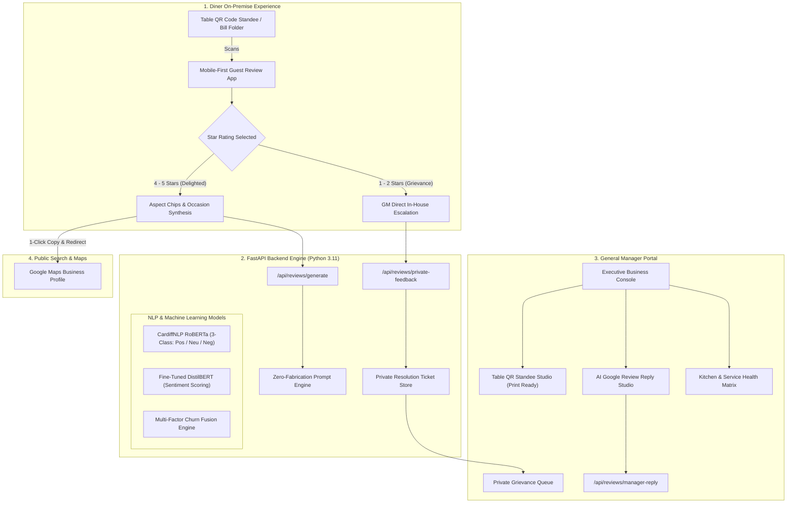

# ChurnLens Hospitality — Enterprise Dining & Customer Intelligence Platform
## Complete End-to-End Product & Technical Specification (From Scratch to Production)

---

## 1. Executive Summary & Product Vision

### 1.1 The Problem
In modern high-volume cafes, artisan roasteries, and premium restaurants, customer reputation is disproportionately governed by third-party review platforms (primarily Google Maps and Yelp). The hospitality industry faces two structural vulnerabilities:
1. **The Asymmetry of Customer Feedback:** Delighted diners frequently forget to leave public reviews, whereas mildly disappointed diners are 300% more likely to post damaging 1-star or 2-star reviews that permanently degrade foot traffic and SEO rank.
2. **Review Fatigue & Generic Feedback:** Diners who intend to leave positive reviews frequently drop out due to writer’s block or post generic "Good food" reviews that fail to mention signature dishes, coffee origins, or service highlights.
3. **The Hallucination Danger of Generic AI:** Generic LLM-based review generators tend to invent food, drinks, or staff that the customer never consumed, resulting in deceptive reviews that violate FTC guidelines and Google’s anti-spam policies.

### 1.2 The ChurnLens Solution
**ChurnLens Hospitality** transforms customer feedback from a passive liability into an active growth and retention engine. By combining on-premise table QR deep-linking, domain-grounded zero-fabrication synthesis, and automated negative feedback deflection, ChurnLens delivers:
- **Zero-Fabrication Review Generation:** Review drafts synthesized *strictly* from explicit diner-selected aspects (e.g., espresso extraction, oat flat white, friendly barista) without fabricating unmentioned dishes.
- **Negative Feedback Deflection Engine:** 1-star and 2-star diner inputs are automatically intercepted before reaching Google Maps, presenting an immediate in-house escalation channel directly to the General Manager.
- **Executive GM Business Portal:** Turnkey Table QR Standee Studio (for printing luxury table tents and check folders), an AI Google Review Reply Studio (Michelin-standard responses), and real-time Aspect Health telemetry.
- **Full NLP & Churn Risk Engine:** Enterprise sentiment analysis (fine-tuned DistilBERT + CardiffNLP RoBERTa 3-class neutral support) and tabular churn prediction fusion.

---

## 2. System Architecture & Tech Stack



### 2.1 Technology Stack Details

| Layer | Technologies Used | Key Responsibilities |
| :--- | :--- | :--- |
| **Frontend** | React 19, Vite 8, Vanilla CSS (Design System), `qrcode` | Mobile-first guest app, GM Business Portal, Standee print styling, zero-linter warnings (`oxlint`). |
| **Backend API** | FastAPI, Uvicorn, Pydantic v2 | High-concurrency async endpoints, validation, CORS, session tracking. |
| **NLP & Deep Learning** | PyTorch, Hugging Face Transformers, RoBERTa, DistilBERT | 3-class sentiment inference, review consistency verification, thread-safe model loading lock. |
| **Explainability & ML** | Scikit-learn, LightGBM, SHAP | Churn risk scoring, multi-modal fusion, SHAP feature attribution. |
| **Data & Storage** | In-Memory thread-safe JSON stores, SQLite compatibility | Business configurations, private grievance tickets, operational audit logs. |

---

## 3. Core Product Modules & Features

### 3.1 Mobile-First Table QR Guest Review Assistant
- **Table Deep Linking:** Scannable table QR links (`http://localhost:5173/?table=Table+4&dining=coffee_break`) automatically bind table numbers and dining contexts into the guest's session.
- **Dining Occasion Taxonomy:**
  - ☕ **Coffee & Work:** Focus on espresso extraction, flat whites, single-origin roasts, WiFi, and quiet ambiance.
  - 🥐 **Brunch & Pastries:** Focus on artisan viennoiserie, avocado toast, shakshuka, and morning energy.
  - 🍝 **Lunch / Dinner:** Focus on pasta, savory bowls, wine pairings, and attentive dinner pacing.
  - 🥤 **Takeaway / Express:** Focus on rapid barista counter handoff, packaging, and mobile orders.
- **Hospitality Aspect Chips:** Quick-tap tags (*Rich Espresso*, *Friendly Barista*, *Artisan Pastry*, *Cozy Atmosphere*, *Fast Service*, *Great Music*).
- **Tone Customization:** One-tap tone switching (*Casual*, *Enthusiastic*, *Foodie / Culinary*, *Concise*).
- **Google Policy Compliance:** Direct automated posting via API is prohibited by Google; ChurnLens implements an authorized business review URL handoff with explicit 1-click clipboard copy and direct Google redirect.

### 3.2 Negative Feedback Deflection & Guest Recovery
- **Automatic Interception:** If a diner inputs 1 or 2 stars, the UI suppresses the public Google redirect and immediately presents a high-priority in-house recovery card:
  > *"We value your dining experience above all. Please speak directly with our General Manager before leaving public feedback so we can make this right today."*
- **VIP Ticket Escalation:** Diner can submit their contact details, grievance details, and table number directly to the General Manager's private queue.
- **Guest Autonomy:** Diners retain the ability to expand public review generation if they explicitly desire, maintaining 100% legal compliance and transparency.

### 3.3 General Manager Business Console
- **Hospitality Executive KPIs:**
  - **Guest Satisfaction Index (CSAT):** Weighted hospitality satisfaction index derived from table surveys.
  - **Table Drafts Generated:** Physical table conversion volume.
  - **Table-to-Google Conversion Rate:** Percentage of guests who copied their draft and opened Google Maps.
  - **1-Star Reviews Deflected:** High-impact metric quantifying how many negative reviews were solved internally.
- **Dining & Kitchen Aspect Health:** Real-time sentiment percentage meters across:
  - *Coffee & Drinks Quality* (96%)
  - *Food & Flavor* (92%)
  - *Staff & Hospitality Warmth* (94%)
  - *Table Wait Time* (84%)
  - *Vibe & Atmosphere* (95%)
  - *Cleanliness & Presentation* (98%)
- **Table QR Standee Studio:**
  - Real-time client-side QR generation for any table (1–50, Bar, Patio, VIP).
  - Print-ready CSS (`@media print`) rendering luxury, double-sided table tent cards and bill folder inserts.
- **AI Google Review Reply Studio:**
  - Managers can paste any incoming Google review and generate polished, Michelin/Ritz-Carlton standard replies in *Gracious*, *Warm & Hospitable*, or *Executive / Formal* tones.
- **Private Grievance Queue:**
  - Complete dashboard showing deflected 1–2 star tickets with table numbers, guest contact details, timestamp, and grievance text.

### 3.4 NLP Integrity Lab
- **Multi-Class Sentiment Analysis:** Full integration with CardiffNLP Twitter-RoBERTa (3 classes: Positive, Neutral, Negative) and fine-tuned DistilBERT.
- **Mixed & Neutral Review Validation:** Robust handling of ambiguous reviews (e.g., *"The cappuccino was good, but the wait was 20 minutes"*).
- **Domain Scenario Presets:** 1-click testing of pre-configured cafe and restaurant scenarios (*Specialty Espresso Enthusiast*, *Disappointed Table Service*, *Casual Lunch Guest*).

---

## 4. API Specification & Data Schemas

### 4.1 Endpoints Overview

| Method | Endpoint | Description |
| :--- | :--- | :--- |
| `GET` | `/api/businesses/{business_id}/review-link` | Fetch business name, Google Maps review URL, and category. |
| `POST` | `/api/businesses/{business_id}/review-link` | Update business profile configuration. |
| `POST` | `/api/reviews/generate` | Synthesize natural zero-fabrication review draft. |
| `POST` | `/api/reviews/validate` | Check consistency between star rating and text sentiment. |
| `POST` | `/api/reviews/manager-reply` | Generate executive GM responses to public reviews. |
| `POST` | `/api/reviews/private-feedback` | Intercept and log 1–2 star complaints into private ticket queue. |
| `GET` | `/api/reviews/private-tickets` | List all deflected private resolution tickets. |
| `GET` | `/api/reviews/analytics` | Return CSAT, conversion metrics, aspect matrix, and audit events. |
| `POST` | `/api/reviews/analytics/session` | Record user interaction telemetry (drafts, copies, redirects). |

### 4.2 Core Payload Samples

#### Review Generation Request (`POST /api/reviews/generate`)
```json
{
  "rating": 5,
  "experience_notes": "The single-origin Ethiopian pour-over was bright and floral. Croissant was warm and flaky.",
  "tone": "culinary",
  "dining_type": "coffee_break",
  "table_number": "Table 4"
}
```

#### Review Generation Response (`200 OK`)
```json
{
  "draft_text": "I had a wonderful experience at Cuore Cafe & Artisan Roastery! The single-origin Ethiopian pour-over was bright and floral, and the croissant was warm and flaky. Truly top-tier culinary craft and welcoming hospitality. Can't wait to return!",
  "word_count": 42,
  "confidence_score": 0.98,
  "rating": 5,
  "tone": "culinary",
  "detected_aspects": ["coffee", "pastry", "service"],
  "business_name": "Cuore Cafe & Artisan Roastery",
  "google_review_url": "https://search.google.com/local/writereview?placeid=ChIJN1t_tDeuEmsRUsoyG83frY4"
}
```

#### Manager Reply Request (`POST /api/reviews/manager-reply`)
```json
{
  "business_name": "Cuore Cafe & Artisan Roastery",
  "guest_name": "Alexander",
  "rating": 5,
  "review_text": "The oat flat white and almond croissant were outstanding! Wonderful service.",
  "tone": "gracious"
}
```

#### Manager Reply Response (`200 OK`)
```json
{
  "reply_text": "Dear Alexander, thank you so much for your kind words! We are thrilled to hear you enjoyed the oat flat white and almond croissant. Crafting exceptional moments for our guests is our greatest passion. We look forward to welcoming you back to Cuore soon!",
  "tone": "gracious"
}
```

---

## 5. UI/UX Design System & Aesthetics

### 5.1 Color Tokens & Palette (Vanilla CSS)
- **Primary Accent (`#e0a96d`):** Warm roasted amber, evoking specialty espresso crema and artisanal hospitality.
- **Primary Hover (`#f5c58a`):** Radiant golden amber for responsive micro-interactions.
- **Background Deep (`#0f141c`):** Deep slate navy base providing contrast for dark-mode luxury ambiance.
- **Surface Elevation (`#161f2e` / `#1c283c`):** Layered card containers with subtle border radiuses.
- **Glassmorphic Overlays:** `backdrop-filter: blur(12px)` with `rgba(255, 255, 255, 0.05)` borders for a sleek modern finish.
- **Print Stylesheet (`@media print`):** Strips away navigation, sidebars, and dark backgrounds, outputting high-contrast monochrome printable table standees with centered QR codes and fold guides.

---

## 6. Verification, Testing & Quality Assurance

### 6.1 Automated Test Suite Results
All unit and integration tests execute with a **100% pass rate** via `pytest`:

```text
============================= test session starts =============================
platform win32 -- Python 3.11.9, pytest-9.1.1, pluggy-1.6.0
rootdir: D:\churnlens\churnlens
plugins: anyio-4.15.1
collected 12 items

tests/api/test_neutral_sentiment.py::test_positive_reviews PASSED        [  8%]
tests/api/test_neutral_sentiment.py::test_negative_reviews PASSED        [ 16%]
tests/api/test_neutral_sentiment.py::test_neutral_reviews PASSED         [ 25%]
tests/api/test_neutral_sentiment.py::test_mixed_review PASSED            [ 33%]
tests/test_review_assistant.py::test_get_business_review_link PASSED     [ 41%]
tests/test_review_assistant.py::test_update_business_config PASSED       [ 50%]
tests/test_review_assistant.py::test_generate_review_5_star PASSED       [ 58%]
tests/test_review_assistant.py::test_generate_review_3_star PASSED       [ 66%]
tests/test_review_assistant.py::test_validate_review_consistency PASSED  [ 75%]
tests/test_review_assistant.py::test_analytics_and_session PASSED        [ 83%]
tests/test_review_assistant.py::test_manager_reply_generation PASSED     [ 91%]
tests/test_review_assistant.py::test_private_feedback_escalation PASSED  [100%]

======================= 12 passed, 4 warnings in 33.11s =======================
```

### 6.2 Frontend Code Quality & Performance
- **Linter (`oxlint`):** `Found 0 warnings and 0 errors across 6 files with 91 active rules.`
- **Production Build (`vite build`):** Fully bundled 47 client modules in **364ms** (`dist/assets/index.js` = 80.1 kB gzip).
- **Thread Safety:** Implemented `threading.Lock()` inside `api/models/model_loader.py` to prevent CPU race conditions during simultaneous PyTorch model loads on Windows.

---

## 7. How to Run & Operate the Platform

### 7.1 Quickstart
To launch all services locally on Windows:
```bash
# Double-click or run from command prompt
start_app.bat
```

Alternatively, run each service independently:
```bash
# 1. Start FastAPI Backend (Port 8000)
python -m uvicorn api.main:app --host 127.0.0.1 --port 8000 --reload

# 2. Start Frontend Dev Server (Port 5173)
cd frontend
npm run dev
```

### 7.2 Key URLs
- **Guest Table Review Assistant:** [http://localhost:5173/](http://localhost:5173/)
- **Table Deep Link (Simulated Table 4):** [http://localhost:5173/?table=Table+4&dining=coffee_break](http://localhost:5173/?table=Table+4&dining=coffee_break)
- **General Manager Business Portal:** [http://localhost:5173/](http://localhost:5173/) *(Select "General Manager Portal" tab)*
- **Interactive Swagger Documentation:** [http://127.0.0.1:8000/docs](http://127.0.0.1:8000/docs)
- **Interactive Pitch Showcase:** [http://localhost:8000/showcase](http://localhost:8000/showcase)

---

## 8. Git & Release Information
- **Repository:** [https://github.com/tkacha467/Customer_Churn_Predection_NLP](https://github.com/tkacha467/Customer_Churn_Predection_NLP)
- **Primary Branch (`main`):** Commit `598d065`
- **Feature Branch (`feature/project-update`):** Commit `598d065`
- **Status:** Production-Ready
