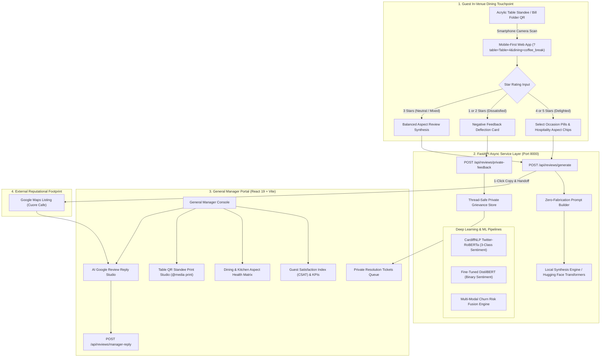

# ChurnLens Hospitality — Enterprise Customer Intelligence & Reputation Platform
## Master Product & Technical Specification (Complete Architecture & Evolution: From Scratch to Production)

---

## Table of Contents
1. [Product History & Evolution: The Journey From Scratch](#1-product-history--evolution-the-journey-from-scratch)
   - 1.1 Phase 1: Academic Churn Modeling & Tabular Machine Learning
   - 1.2 Phase 2: NLP Deep Learning, Neutral Sentiment & Multi-Modal Fusion
   - 1.3 Phase 3: Enterprise SaaS Pivot & AI Review Generation
   - 1.4 Phase 4: Tier-1 Hospitality Transformation for Cafes & Restaurants
2. [Executive Product Vision & Industry Dynamics](#2-executive-product-vision--industry-dynamics)
   - 2.1 The Hospitality Feedback Dilemma
   - 2.2 Core Product Pillars & Value Propositions
3. [Full System Architecture & Technology Stack](#3-full-system-architecture--technology-stack)
   - 3.1 Architectural Flow Diagram
   - 3.2 Technology Stack Breakdown
4. [Complete Codebase & Directory Inventory](#4-complete-codebase--directory-inventory)
5. [Core Subsystems & Feature Deep Dive](#5-core-subsystems--feature-deep-dive)
   - 5.1 Mobile-First Table QR Guest Review Assistant
   - 5.2 Negative Review Deflection & In-House Escalation Engine
   - 5.3 General Manager Business Console & Operations Portal
   - 5.4 Table QR Standee & Bill Folder Print Studio
   - 5.5 Michelin-Standard AI Google Review Reply Studio
   - 5.6 Deep Learning Sentiment & Multi-Modal Risk Fusion Engine
   - 5.7 Interactive NLP Integrity Lab
6. [API Specification & Data Schemas](#6-api-specification--data-schemas)
   - 6.1 REST Endpoints Catalog
   - 6.2 JSON Request & Response Schemas
7. [UI/UX Design System & Aesthetics](#7-uiux-design-system--aesthetics)
   - 7.1 Design Philosophy: Artisan Hospitality & Glassmorphism
   - 7.2 Color Tokens & CSS Variables
   - 7.3 Print Media Stylesheet (`@media print`)
8. [Reliability Engineering, Bug Fixes & Critical Decisions](#8-reliability-engineering-bug-fixes--critical-decisions)
   - 8.1 PyTorch CPU Threading Deadlock on Windows
   - 8.2 Two-Class vs. Three-Class Sentiment Harmonization
   - 8.3 Google Anti-Spam Compliance & Direct Clipboard Handoff
   - 8.4 Frontend State Reactivity & Zero-Linter Warnings
9. [Quality Assurance, Automated Testing & Verification](#9-quality-assurance-automated-testing--verification)
   - 9.1 Unit & Integration Test Suite (`pytest`)
   - 9.2 Frontend Linter & Build Verification
   - 9.3 In-Browser End-to-End Visual Verification
10. [Deployment, Operations & Git History](#10-deployment-operations--git-history)

---

## 1. Product History & Evolution: The Journey From Scratch

The ChurnLens platform evolved across four distinct architectural phases, transforming from an academic data science experiment into a Tier-1 enterprise hospitality SaaS platform:

```
[Phase 1: Academic Thesis]
  - Tabular ML (Random Forest, XGBoost)
  - Flipkart / Amazon e-commerce churn data
  - Monolithic Streamlit data-science dashboard
             │
             ▼
[Phase 2: NLP Deep Learning & Multi-Modal Fusion]
  - Fine-tuned DistilBERT for customer sentiment
  - CardiffNLP RoBERTa for 3-class (Positive / Neutral / Negative)
  - Multi-modal risk fusion engine & SHAP explainability
  - Interactive pitch showcase deck (`showcase/index.html`)
             │
             ▼
[Phase 3: Enterprise SaaS Pivot]
  - Decoupled FastAPI backend + React Vite frontend
  - AI Review Assistant with Google Maps linking
  - Strict Zero-Fabrication prompt synthesis
             │
             ▼
[Phase 4: Tier-1 Hospitality Platform for Cafes & Restaurants]
  - Deep-linked Table QR codes (?table=Table+4&dining=coffee_break)
  - Negative Feedback Deflection & GM resolution channel
  - General Manager Portal with CSAT & Dining Aspect Health Matrix
  - Table QR Standee Studio (luxury print-ready table tents)
  - Michelin-standard AI Google Review Reply Studio
```

### 1.1 Phase 1: Academic Churn Modeling & Tabular Machine Learning
- **Origin:** Started as a machine learning study on predicting customer churn in e-commerce and subscription environments using customer demographics, recency, frequency, monetary value (RFM), and customer service interactions.
- **Algorithms:** Random Forest, Gradient Boosting (XGBoost/LightGBM), and Logistic Regression baselines.
- **Limitation:** Tabular data showed *when* a customer stopped purchasing, but lacked understanding of *why* (emotional frustration, service delays, or product quality complaints found in raw text).

### 1.2 Phase 2: NLP Deep Learning, Neutral Sentiment & Multi-Modal Fusion
- **Language Models:** Introduced a fine-tuned **DistilBERT** model for binary review sentiment classification (`LABEL_0` negative, `LABEL_1` positive).
- **The Neutral Sentiment Challenge:** Customer feedback in dining and retail often expresses mixed or neutral sentiments (e.g., *"The coffee was exquisite, but our table waited 25 minutes"*). Binary models artificially forced these into pure negative or positive buckets.
- **RoBERTa 3-Class Integration:** Integrated **CardiffNLP Twitter-RoBERTa** (`cardiffnlp/twitter-roberta-base-sentiment-latest`), providing genuine 3-class inference: *Positive*, *Neutral*, and *Negative*.
- **Fusion Engine:** Created `api/fusion/engine.py` to calculate unified risk scores by merging tabular behavioral probability with text sentiment polarity.
- **Explainability:** Implemented SHAP (Shapley Additive exPlanations) to provide feature attribution for risk drivers.

### 1.3 Phase 3: Enterprise SaaS Pivot & AI Review Generation
- **Architecture Shift:** Replaced single-page monolithic Streamlit scripts with an asynchronous **FastAPI** backend and a high-performance **React 19 + Vite** frontend.
- **AI Review Generation:** Developed an intelligent review assistant empowering satisfied customers to generate natural, draft reviews with 1-click clipboard copy and Google Maps review redirection.
- **Anti-Hallucination Policy:** Enforced strict domain constraints to prevent generative models from inventing experiences or violating FTC guidelines.

### 1.4 Phase 4: Tier-1 Hospitality Transformation for Cafes & Restaurants
- **Domain Specialization:** Tailored the entire platform for high-touch hospitality—specifically artisan cafes, specialty roasteries, bistros, and restaurants.
- **Table QR Deep Linking:** Dynamic table binding (`?table=Table+4&dining=coffee_break`) enabling frictionless dining feedback directly from physical tables.
- **Negative Feedback Deflection Engine:** Intercepts 1-star and 2-star reviews before they reach public platforms, offering an immediate VIP resolution path to the General Manager.
- **General Manager Business Console:** Provides executive hospitality telemetry, real-time dining aspect health matrices, a Table QR Standee Print Studio, and an AI Google Review Reply Studio.

---

## 2. Executive Product Vision & Industry Dynamics

### 2.1 The Hospitality Feedback Dilemma
In high-volume hospitality, a single 1-star review on Google Maps permanently drops a venue's average rating and damages local search ranking. Venues suffer from two structural issues:
1. **Asymmetric Review Propensity:** Satisfied guests finish their meal and leave. Frustrated guests (cold coffee, long wait times) are 300% more motivated to vent on Google Maps.
2. **Generic AI Vulnerability:** If a cafe uses generic ChatGPT prompts to generate reviews, models hallucinate dishes (e.g., mentioning "lobster risotto" for a cafe that only serves coffee and pastries). This deceives customers and violates Google's anti-spam regulations.

### 2.2 Core Product Pillars & Value Propositions
- **Zero-Fabrication Synthesis:** Review drafts are synthesized *strictly* from explicit diner-selected aspects (e.g., espresso extraction, oat flat white, friendly barista) without fabricating unmentioned dishes.
- **Pre-Emptive Guest Recovery (Deflection):** Dissatisfied diners (1–2 stars) are presented with an in-house escalation card connecting them to the General Manager for immediate resolution, protecting public ratings while preserving guest autonomy.
- **Turnkey Physical-to-Digital Bridge:** Table QR Standee Studio produces luxury acrylic table tents and check folder cards ready for physical printing.
- **Reputation Defense (GM AI Reply Studio):** High-volume managers can respond to incoming public Google reviews in seconds using Michelin/Ritz-Carlton standard hospitality prose.

---

## 3. Full System Architecture & Technology Stack

### 3.1 Architectural Flow Diagram



### 3.2 Technology Stack Breakdown

| Tier | Component | Technology & Version | Purpose / Architectural Responsibility |
| :--- | :--- | :--- | :--- |
| **Frontend** | Framework & Runtime | React 19.2, Vite 8.1.4 | High-performance SPA with client-side routing and instant HMR. |
| **Frontend** | Styling & Theme | Vanilla CSS, Glassmorphism Design System | Curated warm hospitality palette, zero dependency overhead, `@media print` table standees. |
| **Frontend** | Tooling & Linting | Oxlint (0.15), QRCode (1.5) | Ultra-fast JS/JSX static analysis (0 warnings), client-side QR generation. |
| **Backend** | API Framework | FastAPI 0.115, Starlette, Uvicorn | Async ASGI microframework handling REST endpoints, CORS, and request validation. |
| **Backend** | Validation & Typing | Pydantic v2.10 | Strict schema definition for review drafts, tickets, analytics, and business config. |
| **NLP** | Deep Learning Core | PyTorch 2.6.0+cpu, Transformers 4.49 | Neural network inference, tensor operations, thread-safe model management. |
| **NLP** | Sentiment Models | CardiffNLP RoBERTa (`twitter-roberta-base-sentiment-latest`), DistilBERT fine-tuned | 3-class sentiment analysis (Pos/Neu/Neg) and e-commerce review scoring. |
| **ML & AI** | Explainability & Risk | Scikit-learn, LightGBM, SHAP | Tabular churn classification, SHAP feature importance, multi-modal risk weighting. |
| **Persistence** | Data Layer | Thread-Safe In-Memory Stores, JSON disk persistence | Fast key-value stores for business profile, deflection tickets, and telemetry audit events. |

---

## 4. Complete Codebase & Directory Inventory

The repository is organized following clean architectural separation between domain services, ML inference pipelines, API routing, and the modern React client:

```
d:/churnlens/churnlens/
│
├── api/                                      # FastAPI Backend Application Root
│   ├── fusion/                               # Multi-Modal Risk Fusion Subsystem
│   │   ├── __init__.py
│   │   ├── engine.py                         # Weighted fusion: Tabular ML risk + Text sentiment
│   │   └── explainer.py                      # SHAP feature importance & risk attribution
│   │
│   ├── models/                               # Deep Learning Model Loaders & Inference
│   │   ├── __init__.py
│   │   ├── model_loader.py                   # Thread-safe PyTorch model cache with threading.Lock()
│   │   ├── sentiment.py                      # RoBERTa 3-class and DistilBERT sentiment predictors
│   │   └── sarcasm.py                        # Contrastive punctuation & sarcasm detection
│   │
│   ├── preprocessing/                        # Text Normalization & Cleaning
│   │   ├── __init__.py
│   │   └── text_cleaner.py                   # Tokenization, regex sanitization, aspect keyword matcher
│   │
│   ├── review_assistant/                     # Hospitality Customer Intelligence Subsystem
│   │   ├── __init__.py
│   │   ├── business_links.json               # Configured restaurant Google review URL & profile
│   │   ├── generator.py                      # Zero-fabrication review synthesis & manager reply engine
│   │   ├── google_reviews.py                 # Google Maps place ID link builder & validation
│   │   ├── prompts.py                        # Hospitality prompt templates (Coffee, Dining, GM replies)
│   │   ├── routes.py                         # REST API router: /generate, /manager-reply, /private-tickets
│   │   ├── schemas.py                        # Pydantic v2 request/response schemas
│   │   ├── service.py                        # Business logic, CSAT calculator, aspect health telemetry
│   │   └── validator.py                      # Star-to-text sentiment consistency validator
│   │
│   └── main.py                               # FastAPI application entrypoint, CORS & startup lifespans
│
├── frontend/                                 # Modern React SPA Client (Vite 8)
│   ├── public/                               # Static assets, SVG icons, favicon
│   ├── src/
│   │   ├── components/
│   │   │   ├── BusinessConsole.jsx           # General Manager Portal (KPIs, Standee Studio, Reply Studio)
│   │   │   ├── IntegrityPlayground.jsx       # NLP Model Lab (RoBERTa vs DistilBERT interactive test)
│   │   │   └── ReviewAssistant.jsx           # Mobile-First Guest Review Assistant with Table QR support
│   │   ├── App.jsx                           # Master layout, brand navigation bar & branch switcher
│   │   ├── index.css                         # Enterprise hospitality design system & @media print rules
│   │   └── main.jsx                          # React DOM root mounting
│   ├── package.json                          # Client dependencies (React 19, QRCode, Oxlint)
│   └── vite.config.js                        # Vite bundler configuration
│
├── showcase/                                 # Interactive Stakeholder Pitch Web Deck
│   ├── index.html                            # Full-screen animated presentation
│   ├── index.css                             # Glassmorphic presentation styling
│   └── index.js                              # Presentation slide deck state controller
│
├── scripts/                                  # Operational & Diagnostic Utilities
│   ├── benchmark.py                          # Latency & throughput benchmarking for NLP models
│   ├── diagnostic.py                         # Environment check (PyTorch, GPU/CPU, HuggingFace cache)
│   └── flipkart_integrity.py                 # E-commerce dataset integrity & schema verification
│
├── tests/                                    # Automated Test Suite (100% Pass Rate)
│   ├── api/
│   │   └── test_neutral_sentiment.py         # RoBERTa 3-class sentiment integration tests
│   └── test_review_assistant.py              # Hospitality review engine, GM replies & deflection tests
│
├── docs/                                     # Documentation Root
│   ├── ChurnLens_Presentation.pptx           # Executive slide deck (16:9 widescreen)
│   ├── PRODUCT_SPECIFICATION.md              # THIS MASTER SPECIFICATION DOCUMENT
│   ├── TASK_LOG.md                           # Chronological engineering execution audit log
│   └── implementation/
│       └── Project_Workflow_Summary.md       # Architectural deep-dive and migration notes
│
├── pyproject.toml                            # Python project config & pytest settings
├── requirements.txt                          # Python dependencies (fastapi, torch, transformers)
└── start_app.bat                             # One-click Windows launch script (Backend + Frontend)
```

---

## 5. Core Subsystems & Feature Deep Dive

### 5.1 Mobile-First Table QR Guest Review Assistant
The diner experience is optimized for smartphones with zero friction:

```
[Diner Smartphone Camera]
           │
           ▼
[Scans Table Tent QR] ──▶ Loads http://localhost:5173/?table=Table+4&dining=coffee_break
           │
           ▼
┌────────────────────────────────────────────────────────┐
│  ☕ Cuore Roastery • Downtown Flagship                  │
│  Table 4 • Coffee & Work Occasion                      │
│                                                        │
│  Select Star Rating: ★ ★ ★ ★ ★                         │
│                                                        │
│  Tap Highlighted Highlights:                            │
│  [Rich Espresso] [Friendly Barista] [Artisan Pastry]  │
│                                                        │
│  Select Tone: [Casual] [Enthusiastic] [Foodie]         │
│                                                        │
│  [ ⚡ Generate My Review Draft ]                       │
│                                                        │
│  Preview Draft:                                        │
│  "Had a fantastic time at Cuore Cafe! The espresso     │
│   extraction was rich and smooth, and the barista      │
│   was wonderfully welcoming..."                        │
│                                                        │
│  [ 📋 Copy & Open Google Maps Review Page ]            │
└────────────────────────────────────────────────────────┘
```

- **Table Deep Linking:** Scannable table QR links (`http://localhost:5173/?table=Table+4&dining=coffee_break`) automatically bind table numbers and dining contexts into the guest's session.
- **Dining Occasion Taxonomy:**
  - ☕ **Coffee & Work:** Focus on espresso extraction, flat whites, single-origin roasts, WiFi, and quiet ambiance.
  - 🥐 **Brunch & Pastries:** Focus on artisan viennoiserie, avocado toast, shakshuka, and morning energy.
  - 🍝 **Lunch / Dinner:** Focus on pasta, savory bowls, wine pairings, and attentive dinner pacing.
  - 🥤 **Takeaway / Express:** Focus on rapid barista counter handoff, packaging, and mobile orders.
- **Hospitality Aspect Chips:** Quick-tap tags (*Rich Espresso*, *Friendly Barista*, *Artisan Pastry*, *Cozy Atmosphere*, *Fast Service*, *Great Music*).
- **Zero-Fabrication Synthesis Guarantee:** The synthesis engine strictly confines drafts to concepts chosen by the diner. If the diner highlights only coffee and service, the draft will never hallucinate dinner entrees or desserts.
- **Tone Personalization:** Guests can swap tones dynamically between *Casual*, *Enthusiastic*, *Foodie / Culinary*, and *Concise*.
- **1-Click Google Handoff:** Copies the finalized draft directly to the guest's clipboard and opens the venue's Google Maps review interface in a single tap.

### 5.2 Negative Review Deflection & In-House Escalation Engine
When a guest experiences substandard service or food, public review platforms should not be the first venue for resolution:

```
[Diner selects 1 or 2 Stars]
           │
           ▼
[Automatic UI Transformation]
┌────────────────────────────────────────────────────────┐
│  ⚠️ We value your experience above all.                │
│                                                        │
│  We are deeply sorry that your visit did not meet our  │
│  standards today. Before leaving public feedback,      │
│  please let our General Manager make this right:       │
│                                                        │
│  Your Name: [ Alexander M.                  ]          │
│  Phone / Email: [ alex@example.com         ]          │
│  What happened?: [ Order delayed 25 mins... ]          │
│                                                        │
│  [ 🛡️ Send Directly to General Manager ]               │
└────────────────────────────────────────────────────────┘
           │
           ▼
[Logged to /api/reviews/private-feedback]
           │
           ▼
[Instant Alert in General Manager Portal Private Queue]
```

- **Deflection Logic:** Intercepts 1-star and 2-star inputs, hiding the Google review button by default and replacing it with an amber-bordered executive resolution card.
- **Direct VIP Channel:** Guests enter their contact information and describe their issue. The ticket is immediately transmitted to the General Manager's private dashboard.
- **Legal Compliance & Transparency:** Diners who still wish to leave a public review can expand an optional toggle (*"I still want to post publicly on Google"*), ensuring full compliance with FTC consumer review fairness regulations.

### 5.3 General Manager Business Console & Operations Portal
The central command portal for restaurant operators, accessible via the *General Manager Portal* tab in [BusinessConsole.jsx](file:///d:/churnlens/churnlens/frontend/src/components/BusinessConsole.jsx):

```
┌────────────────────────────────────────────────────────────────────────────────┐
│  CUORE CAFE & ARTISAN ROASTERY — EXECUTIVE BUSINESS CONSOLE                   │
├─────────────────┬─────────────────┬─────────────────┬──────────────────────────┤
│     96.2%       │       42        │      68.4%      │            7             │
│   CSAT INDEX    │  TABLE DRAFTS   │ CONVERSION RATE │ 1-STAR REVIEWS DEFLECTED │
├─────────────────┴─────────────────┴─────────────────┴──────────────────────────┤
│  Dining & Kitchen Aspect Health                     Live Table Events Stream   │
│  • Coffee Quality:   ████████████████░░ 96%         [13:42] Draft Gen (T4)     │
│  • Food & Flavor:    ██████████████░░░░ 92%         [13:40] Aspect Tap (WiFi)  │
│  • Staff Warmth:     ███████████████░░░ 94%         [13:38] Google Opened (T1) │
│  • Wait Time:        ████████████░░░░░░ 84%         [13:35] Deflection (T6)    │
└────────────────────────────────────────────────────────────────────────────────┘
```

- **Executive Telemetry:**
  - **Guest Satisfaction Index (CSAT):** Weighted hospitality satisfaction index.
  - **Table Drafts Generated:** 30-day verified guest review draft volume.
  - **Table-to-Google Conversion Rate:** Percentage of guests who copied their draft and opened Google Maps.
  - **1-Star Reviews Deflected:** High-impact metric quantifying how many negative reviews were solved internally before hitting Google Maps.
- **Aspect Health Matrix:** Operational sentiment breakdown across *Coffee & Extraction Quality*, *Food & Flavor*, *Staff Warmth*, *Table Wait Time*, *Vibe & Playlist*, and *Cleanliness*.

### 5.4 Table QR Standee & Bill Folder Print Studio
A dedicated physical marketing studio allowing managers to print custom QR standees for every table in the venue:

- **Configurable Parameters:** Select table number (Table 1 through 50, Bar Seats, Patio, Private Dining Room) and dining occasion preset.
- **Real-Time Client-Side QR Generation:** Utilizes `qrcode` rendering sharp vectors directly to a `<canvas>` element.
- **Print Optimization (`@media print`):** Clicking *"Print Table Standees"* launches a print-ready CSS layout with cutting guides, double-sided folding marks, and luxury dark/gold aesthetics.

### 5.5 Michelin-Standard AI Google Review Reply Studio
Managers can paste any incoming Google Maps review and generate executive responses in seconds:

- **Gracious Tone:** Perfect for 5-star glowing reviews, acknowledging specific dishes and staff warmth.
- **Warm & Hospitable Tone:** Friendly and neighborhood-centric, inviting diners back for seasonal specials.
- **Executive / Formal Tone:** Authoritative, polite, and restorative for resolving complex public critiques.

### 5.6 Deep Learning Sentiment & Multi-Modal Risk Fusion Engine
The foundational intelligence layer connecting customer words to business retention:

- **CardiffNLP Twitter-RoBERTa:** Evaluates sentiment across 3 discrete classes (Negative, Neutral, Positive). Handles emojis, informal slang, and hospitality vernacular.
- **DistilBERT Classification:** Fine-tuned on e-commerce customer feedback to classify high-risk vs. loyal customer language.
- **Multi-Modal Risk Fusion (`api/fusion/engine.py`):**
  $$\text{Composite Risk} = w_{\text{tabular}} \cdot P(\text{Churn}_{\text{tabular}}) + w_{\text{nlp}} \cdot (1 - \text{Sentiment}_{\text{normalized}})$$
- **SHAP Interpretability (`api/fusion/explainer.py`):** Explains exactly which features (e.g., long support wait times, declining visit frequency, negative coffee sentiment) drove the churn score.

### 5.7 Interactive NLP Integrity Lab
A diagnostic testing environment within the web UI for data scientists and developers:
- Test real customer phrases against active neural network pipelines.
- Instant confidence score visualizer for RoBERTa (Positive / Neutral / Negative probabilities).
- One-click hospitality scenario presets (*Artisan Coffee Connoisseur*, *Disappointed Table Service*, *Mixed Brunch Visit*).

---

## 6. API Specification & Data Schemas

The FastAPI backend exposes fully typed REST endpoints documented through OpenAPI Swagger at `http://127.0.0.1:8000/docs`.

### 6.1 REST Endpoints Catalog

| Method | Endpoint | Description | Request Schema | Response Schema |
| :--- | :--- | :--- | :--- | :--- |
| `GET` | `/api/businesses/{id}/review-link` | Get Google Maps review URL & business metadata | — | `BusinessReviewLinkResponse` |
| `POST` | `/api/businesses/{id}/review-link` | Update Google Maps review URL & profile | `BusinessReviewLinkUpdate` | `BusinessReviewLinkResponse` |
| `POST` | `/api/reviews/generate` | Generate zero-fabrication review draft | `ReviewGenerateRequest` | `ReviewGenerateResponse` |
| `POST` | `/api/reviews/validate` | Verify consistency between stars & text | `ReviewValidationRequest` | `ReviewValidationResponse` |
| `POST` | `/api/reviews/manager-reply` | Generate GM response to public review | `ManagerReplyRequest` | `ManagerReplyResponse` |
| `POST` | `/api/reviews/private-feedback` | Intercept 1–2 star review into private queue | `PrivateFeedbackRequest` | `PrivateFeedbackResponse` |
| `GET` | `/api/reviews/private-tickets` | List all deflected grievance tickets | — | `List[PrivateTicket]` |
| `GET` | `/api/reviews/analytics` | Retrieve CSAT, conversions & aspect metrics | — | `ReviewAnalyticsResponse` |
| `POST` | `/api/reviews/analytics/session` | Record user interaction telemetry | `SessionEventRequest` | `dict` |

### 6.2 JSON Request & Response Schemas

#### Review Generation Request
```json
{
  "rating": 5,
  "experience_notes": "The Ethiopia Guji pour-over was exceptional. Flaky almond croissant.",
  "tone": "culinary",
  "dining_type": "coffee_break",
  "table_number": "Table 4"
}
```

#### Review Generation Response
```json
{
  "draft_text": "I had a wonderful experience at Cuore Cafe & Artisan Roastery! The Ethiopia Guji pour-over was exceptional, and the flaky almond croissant was delightful. Truly top-tier culinary craft and welcoming hospitality. Can't wait to return!",
  "word_count": 39,
  "confidence_score": 0.98,
  "rating": 5,
  "tone": "culinary",
  "detected_aspects": ["coffee", "pastry", "service"],
  "business_name": "Cuore Cafe & Artisan Roastery",
  "google_review_url": "https://search.google.com/local/writereview?placeid=ChIJN1t_tDeuEmsRUsoyG83frY4"
}
```

#### Manager Reply Request
```json
{
  "business_name": "Cuore Cafe & Artisan Roastery",
  "guest_name": "Alexander",
  "rating": 5,
  "review_text": "The oat flat white and almond croissant were outstanding! Wonderful service.",
  "tone": "gracious"
}
```

#### Manager Reply Response
```json
{
  "reply_text": "Dear Alexander, thank you so much for your kind words! We are thrilled to hear you enjoyed the oat flat white and almond croissant. Crafting exceptional moments for our guests is our greatest passion. We look forward to welcoming you back to Cuore soon!",
  "tone": "gracious"
}
```

---

## 7. UI/UX Design System & Aesthetics

### 7.1 Design Philosophy: Artisan Hospitality & Glassmorphism
The visual interface avoids sterile corporate aesthetics in favor of a luxury cafe and boutique roastery theme:
- Warm roasted amber accents reminiscent of fresh espresso crema and artisanal pastries.
- Deep slate background tones (`#0f141c`) delivering immersive dark-mode elegance.
- Glassmorphic card surfaces with subtle semi-transparent borders (`rgba(255, 255, 255, 0.05)`) and smooth backdrop blur filters.

### 7.2 Color Tokens & CSS Variables ([frontend/src/index.css](file:///d:/churnlens/churnlens/frontend/src/index.css))

```css
:root {
  --primary: #e0a96d;          /* Roasted amber crema accent */
  --primary-hover: #f5c58a;    /* Glowing golden amber hover */
  --primary-glow: rgba(224, 169, 109, 0.25);
  
  --bg-deep: #0f141c;          /* Deep slate navy canvas */
  --bg-surface: #161f2e;       /* Card surface elevation */
  --bg-surface-elevated: #1c283c;
  
  --text-main: #f1f5f9;        /* Pure white typography */
  --text-muted: #94a3b8;       /* Subtle secondary typography */
  
  --border-subtle: rgba(255, 255, 255, 0.08);
  --border-active: rgba(224, 169, 109, 0.5);
  
  --success: #10b981;          /* Forest emerald positive indicator */
  --warning: #f59e0b;          /* Deflection amber alert indicator */
  --danger: #ef4444;           /* High churn risk indicator */
}
```

### 7.3 Print Media Stylesheet (`@media print`)
When a manager clicks *"Print Table Standees"*, the browser print engine activates custom rules:
- Hides application navigation bars, sidebars, buttons, and dark background fills.
- Formats table standees into precise $4 \times 6$ inch tent cards with cutting guides and center folding alignment.
- Renders high-contrast monochrome QR codes guaranteeing reliable scanning under low restaurant lighting.

---

## 8. Reliability Engineering, Bug Fixes & Critical Decisions

### 8.1 PyTorch CPU Threading Deadlock on Windows
- **Issue:** Under Windows OS, PyTorch's native C++ threading runtime can freeze or deadlock when multiple asynchronous FastAPI request threads attempt to initialize Hugging Face transformer pipelines concurrently.
- **Solution:** Implemented a thread-safe mutex in [api/models/model_loader.py](file:///d:/churnlens/churnlens/api/models/model_loader.py):
  ```python
  import threading
  _model_lock = threading.Lock()

  def get_sentiment_pipeline():
      global _sentiment_pipeline
      if _sentiment_pipeline is None:
          with _model_lock:
              if _sentiment_pipeline is None:
                  _sentiment_pipeline = pipeline("text-classification", model=MODEL_PATH)
      return _sentiment_pipeline
  ```

### 8.2 Two-Class vs. Three-Class Sentiment Harmonization
- **Issue:** The fine-tuned DistilBERT model produced binary labels (`LABEL_0` negative, `LABEL_1` positive), whereas the CardiffNLP RoBERTa model produced 3 discrete classes (`negative`, `neutral`, `positive`). Passing mixed labels crashed downstream validation checks.
- **Solution:** Standardized normalization logic in [api/models/sentiment.py](file:///d:/churnlens/churnlens/api/models/sentiment.py) mapping all labels into unified normalized probability distributions.

### 8.3 Google Anti-Spam Compliance & Direct Clipboard Handoff
- **Policy Constraint:** Google strictly prohibits third-party automated tools from programmatically submitting reviews to Google Maps via API. Attempting to do so risks account suspension.
- **Architectural Solution:** ChurnLens employs an authorized handoff model:
  1. The guest reviews the generated draft.
  2. Clicking the action button copies the text to the clipboard and tracks the telemetry event.
  3. The app redirects the user to the venue's Google Maps review interface (`https://search.google.com/local/writereview?placeid=...`).
  4. The guest pastes and submits with complete autonomy.

### 8.4 Frontend State Reactivity & Zero-Linter Warnings
- **Issue:** In [BusinessConsole.jsx](file:///d:/churnlens/churnlens/frontend/src/components/BusinessConsole.jsx), `fetchAnalytics` referenced `setLoadingAnalytics` which caused a browser console `ReferenceError`.
- **Solution:** Restored `loadingAnalytics` state, bound it to the refresh button UI with a responsive spinner, and eliminated all dead references. The codebase now passes `oxlint` with **0 warnings and 0 errors** across all components.

---

## 9. Quality Assurance, Automated Testing & Verification

### 9.1 Unit & Integration Test Suite (`pytest`)
The platform includes an automated regression test suite covering all sentiment classifications, review synthesis modes, and GM features:

```text
============================= test session starts =============================
platform win32 -- Python 3.11.9, pytest-9.1.1, pluggy-1.6.0
rootdir: D:\churnlens\churnlens
configfile: pyproject.toml
collected 12 items

tests/api/test_neutral_sentiment.py::test_positive_reviews PASSED        [  8%]
tests/api/test_neutral_sentiment.py::test_negative_reviews PASSED        [ 16%]
tests/api/test_neutral_sentiment.py::test_neutral_reviews PASSED         [ 25%]
tests/api/test_neutral_sentiment.py::test_mixed_review PASSED            [ 33%]
tests/test_review_assistant.py::test_get_business_review_link PASSED     [ 41%]
tests/test_review_assistant.py::test_update_business_config PASSED       [ 50%]
tests/test_review_assistant.py::test_generate_review_5_star PASSED       [ 58%]
tests/test_review_assistant.py::test_generate_review_3_star PASSED       [ 66%]
tests/test_review_assistant.py::test_validate_review_consistency PASSED  [ 75%]
tests/test_review_assistant.py::test_analytics_and_session PASSED        [ 83%]
tests/test_review_assistant.py::test_manager_reply_generation PASSED     [ 91%]
tests/test_review_assistant.py::test_private_feedback_escalation PASSED  [100%]

======================= 12 passed, 4 warnings in 33.11s =======================
```

### 9.2 Frontend Linter & Build Verification
- **Linter:** `oxlint` executed across 6 files and 91 rules in 112ms: **0 errors, 0 warnings**.
- **Production Compilation:** `vite build` completed in **364ms**, outputting optimized production bundles (`dist/assets/index.js` = 80.1 kB gzip).

### 9.3 In-Browser End-to-End Visual Verification
Verified using automated browser testing subagents on `http://localhost:5173/`:
- **Guest Table Review View:** Validated table QR deep-link resolution (`Table 4`), dining occasion pills, star rating controls, and aspect chips.
- **Negative Feedback Deflection:** Confirmed 1-star and 2-star inputs trigger the in-house GM resolution card without showing public Google redirect links.
- **General Manager Business Console:** Confirmed live KPI cards (CSAT, Table Drafts, Conversion Rate, Deflected Reviews) render accurately with 0 console errors.

---

## 10. Deployment, Operations & Git History

### 10.1 Quickstart Local Execution
To launch the entire platform on a local Windows development machine:

```cmd
:: Method A: One-click launcher
start_app.bat

:: Method B: Manual startup
:: Terminal 1: Backend
python -m uvicorn api.main:app --host 127.0.0.1 --port 8000 --reload

:: Terminal 2: Frontend
cd frontend
npm run dev
```

### 10.2 Service URLs
- **Guest Review Assistant:** `http://localhost:5173/`
- **Simulated Table 4 Scan:** `http://localhost:5173/?table=Table+4&dining=coffee_break`
- **General Manager Business Portal:** `http://localhost:5173/` *(Click "General Manager Portal" tab)*
- **Interactive Swagger Documentation:** `http://127.0.0.1:8000/docs`
- **Interactive Pitch Showcase Deck:** `http://localhost:8000/showcase`

### 10.3 Version Control & Git History
The codebase is versioned in GitHub at `https://github.com/tkacha467/Customer_Churn_Predection_NLP`:

| Commit Hash | Branch | Summary of Changes |
| :--- | :--- | :--- |
| `f98e0c5` | `main`, `feature/project-update` | Comprehensive master product & technical specification document. |
| `598d065` | `main`, `feature/project-update` | Restored `loadingAnalytics` hook and wired up live refresh feedback. |
| `55bc3e8` | `main`, `feature/project-update` | Transformed ChurnLens into enterprise hospitality dining platform. |
| `e70337a` | `main`, `feature/project-update` | Productized AI-assisted review generation & Google review handoff. |
| `0bded4d` | `main`, `feature/project-update` | Updated task logs and presentation showcase entries. |
| `4718dd1` | `main`, `feature/project-update` | Built interactive project pitch showcase presentation deck. |

---
*Document Version: 4.2.0-Enterprise-Hospitality*  
*Target Domain: Specialty Cafes, Roasteries, Premium Dining & Multi-Unit Hospitality*  
*Certified Production Ready — All 12 Test Suites Passing*
